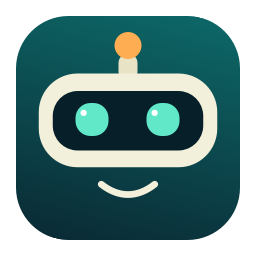

<div align="center">



# Hall-e 🤖

### Your meetings, remembered. Your Mac, a little friendlier.

**Made with cariño in Chile 🇨🇱**

[Download](https://github.com/galdea/Hall-e/releases/latest) · [⭐ Star Hall-e](https://github.com/galdea/Hall-e) · [☕ Buy us a coffee](#support) · [Report a bug](https://github.com/galdea/Hall-e/issues/new/choose)

</div>

Hall-e is an open-source macOS assistant for recording meetings, turning conversations into readable transcripts, and keeping work organized by project.

The name borrows a little from **HAL**, from *2001: A Space Odyssey*, and a lot of heart from **WALL-E**. Smart, helpful, and nice. The airlock stays open. 🌱

## Install, open, meet

1. Download the **DMG** from [the latest release](https://github.com/galdea/Hall-e/releases/latest). Choose **arm64** for Apple silicon or **x86_64** for Intel; check **Apple menu → About This Mac**. Requires **macOS 14 or later**; capturing another app's audio requires **14.2+**.
2. Open the DMG, drag **Hall-e** to **Applications**, eject the disk image, and open Hall-e. A ZIP alternative is available too.
3. Follow four short setup steps: choose your language, allow the microphone, then choose local speech recognition or connect your own cloud transcription key with **Save & test** and allow audio processing. Try the optional **eight-second audio check**. Setup can be resumed later.
4. Choose **Start recording**, name your meeting, and select **Microphone only** for an in-person conversation or **Microphone + your meeting app** for an online call. Join the call first and tell participants you are recording.
5. Stop when you finish. Your audio, transcript, and autosaved notes are together in **Meetings & recordings → Recordings**. Export notes and transcript as one Markdown file.

**No account or API key is needed for supported on-device transcription.** No terminal, calendar account, browser extension, Obsidian, or separate AI subscription is required to record and take notes. Local speech depends on macOS permission and an available language model; setup checks readiness and lets you test it. When unavailable, keep recording and transcribe later, or connect an optional cloud provider. Cloud transcription requires internet access, your own provider account and credit, and explicit permission.

**Release signing:** archives marked `adhoc` are not Apple-notarized. macOS may block the first launch; after verifying the download, use **System Settings → Privacy & Security → Open Anyway** if offered. Managed Macs may disallow this. Archives explicitly marked `notarized` have completed Apple's checks. See [installation and release details](docs/release.md).

## Optional cloud transcription

| Provider | Set up | What Hall-e uses |
| --- | --- | --- |
| **Deepgram** | [Create an API key](https://console.deepgram.com/) | Nova-3 multilingual transcription with speaker diarization |
| **Speechmatics** | [Create an API key](https://portal.speechmatics.com/) | Melia 1 multilingual transcription with speaker diarization; select US or EU processing and confirm Model Training is off |

### Connect a provider when you need it

In **Settings → Transcription → Connect optional cloud transcription**, you can add cloud transcription and anonymous speaker labels. Hall-e **does not ship with the developer’s API keys or shared credit**. Each cloud user connects their own account. Keys are stored in that user’s macOS Keychain.

1. Click **Sign up / open Deepgram** or **Sign up / open Speechmatics**. Create your own account in the browser.
2. Open **API Keys** in the provider’s console and create a key for Hall-e. Deepgram keys belong to a project; choose transcription access. Copy the secret key while it is visible. The setup screen includes each provider’s key-creation guide.
3. Return to Hall-e and click **Paste**. For Speechmatics, select US or EU processing first. Choose **Save & test** (or **Replace & test**). Hall-e checks authentication before saving; a failed replacement preserves your existing key. The clipboard is read only when you click Paste, and the key stays hidden.
4. Allow that provider to transcribe audio. For Speechmatics, confirm that you turned **Model Training off** in its portal.
5. Select **Automatic** or the connected provider, then make a short recording to confirm your key and available credit work. You can add the second provider later.

Existing keys can be checked with **Test saved Deepgram key** or **Test saved Speechmatics key**. Connection checks use read-only requests and do not upload audio or create transcription jobs. Onboarding distinguishes a saved key from one accepted by the selected provider and region. These checks do not verify your balance or access to every model. Provider charges, trial allowances, expiry, and model access depend on your account; signup and billing stay with the provider.

**Save & test is available starting with v0.3.1.** When updating from v0.3.0, use the saved-key test to verify your existing connection without replacing the key. Older installers only check credentials during the first transcription.

In **Automatic** mode, new recordings use local Apple Speech when no cloud provider is configured and authorized. With cloud connected, Automatic prefers Deepgram; Speechmatics can work on its own or as a backup when Deepgram explicitly reports exhausted credit. Each provider needs its own permission. Choose **On this Mac (Apple Speech)** to keep new transcription local even with cloud accounts connected. Existing accepted remote jobs retain their provider, avoiding duplicate submissions.

This works with eligible trial credit or paid accounts; providers set their own trial terms, balances, and prices. Hall-e doesn't create accounts or extend trials. It won't switch providers after an ambiguous upload or bypass your shared monthly spending guard. You can inspect the provider used in the transcript viewer. Recordings stay available when transcription needs attention.

The default **$25 monthly guard** estimates combined transcription spending in Hall-e; it is not a live provider balance or a billing cap. Change it in **Settings → Transcription** and set any account-level limits in your provider dashboard.

## Useful basics

- **Find what was said.** Read, search, copy, and export transcripts. Optional cloud transcription adds anonymous **Speaker 1 / Speaker 2** labels; local speech does not diarize individual voices. Speaker numbers belong to one recording and can be imperfect, especially with overlapping speech.
- **Write alongside the conversation.** Autosaved local notes stay separate from the audio folder and survive audio deletion. Export your notes and transcript together. No external notes app is needed.
- **Keep meetings together.** Choose an existing project or create one while categorizing a meeting. Optionally apply it to future occurrences of a recurring meeting.
- **A gentle nudge.** With a calendar connected, get a gentle ring five minutes before a meeting.
- **Don't record an empty room forever.** After 20 seconds without detected speech, Hall-e asks whether to stop. It waits another 20 seconds, then stops if you don't respond. Change both timings or disable auto-stop in **Settings → Recording**. If audio monitoring is uncertain, Hall-e keeps recording.
- **Your workspace starts clean.** No preloaded personal projects. Recording, transcription, files, and privacy come first; integrations are optional.

## Add more when you need it

- **Calendars & invitations:** connect Google, Outlook/Microsoft 365 (Exchange), and other calendars available in Apple Calendar from Settings when ready. Choose which calendars Hall-e reads, including Teams meeting links. No mailbox or Teams-chat access. No developer credentials needed for the macOS route; [setup and compatibility details](docs/calendar-setup.md).
- **Call capture:** choose a running app when starting a recording, without an extension. Hall-e captures that app's audio, potentially including other playing tabs or windows, never silently all system audio. If capture fails, a visible warning explains that only the microphone is being recorded; join the call, check permissions, and retry meeting audio. The optional bundled Chrome extension and **Settings → Calls** provide additional workflows.
- **Notes folders:** optionally connect an ordinary notes folder. Obsidian can open it too, but isn't required.
- **AI:** optional provider settings enable additional intelligence. The advanced structured-report integration has separate requirements; see [meeting pipeline](docs/operations/MEETING_PIPELINE.md). A transcription API key alone does not generate AI reports.
- **Apple Speech:** the account-free starting path; check or enable it in **Settings → Transcription**. English, Spanish, Portuguese, French, German, and Italian are offered when a compatible local model is available. Automatic local language follows supported Mac language preferences; choose your actual meeting language explicitly when needed.

## Your recordings are yours

API keys live in **macOS Keychain**. Audio, transcripts, the local database, and built-in **Meeting Notes** live under `~/Library/Application Support/Hall-e`; optional integration notes may live in a folder you choose. The onboarding audio test stays local and is deleted after completion or cancellation. Cloud audio processing is off until you enable a provider. Transcript-text AI processing has its own permission. Let everyone know when you record and send a meeting to a cloud service.

To update or share Hall-e, open **Settings → About & support → Check for updates / share Hall-e**. Quit Hall-e before replacing the app in Applications. Your library and provider choices are preserved. Updates are downloaded manually; there is no background auto-updater.

[Privacy details](PRIVACY.md) · [Report a security issue](SECURITY.md)

## Support

### ☕ Buy us a coffee

Hall-e runs on curiosity, cariño, and probably too much coffee. **A donation link is coming soon.** Until then, [give the project a star ⭐](https://github.com/galdea/Hall-e), share it with a friend, or help squash a bug. Stars help people find us; coffee will help us keep building. No nag screens, no features behind donations.

## Build with us

Install Xcode with a Swift 6 toolchain, then:

```sh
git clone https://github.com/galdea/Hall-e.git
cd Hall-e
make test
make app
open dist/Hall-e.app
```

`make release` creates DMG and ZIP installers plus checksums. You don't need a personal signing certificate to build locally. For Developer ID signing, notarization, CI, and supported architectures, see [release documentation](docs/release.md).

Small improvements are welcome: clearer copy, better accessibility, Spanish/English polish, reliable audio capture, and thoughtful bug reports. [Contributing guide](CONTRIBUTING.md).

**[MIT licensed](LICENSE).** Built with SwiftUI, AppKit, and [GRDB](https://github.com/groue/GRDB.swift). See [third-party notices](THIRD_PARTY_NOTICES.md).

*From Chile, with a helpful little robot heart. 🇨🇱 🤖*
